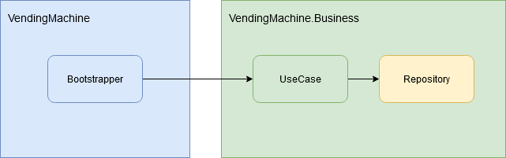
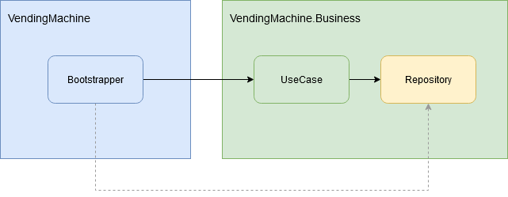
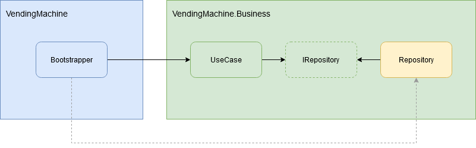
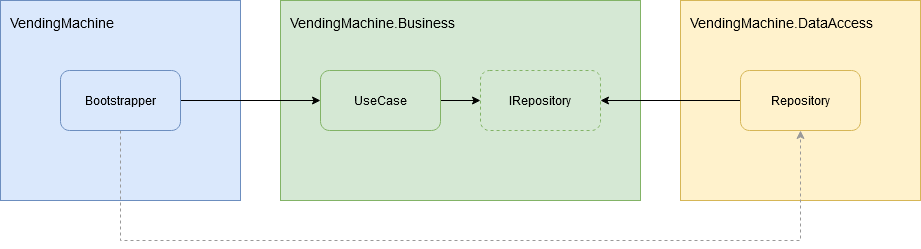

# Dependency Inversion

In another article ([How to apply DIP - Module Separation](../how-to-apply-dip/README.md)) we described the steps needed to extract the Presentation and Data  Access modules from the Business. The last step, Inversion of  Dependency, remained a mystery regarding of how we can implement that at class level. I mean, on a high-level block diagram is easy to draw the  arrows in the other direction, but how to do it successfully in the  code?

Let's go into more details. We will describe the extraction  process of one of the module (the Data Access). For the Presentation  module, the process is similar.

## Step 0 - Initial Situation - Business and Data Access are merged 

In the Business Module we have a `UseCase` class that instantiates and use a Repository class.

  


```csharp
public class UseCase : IUseCase
{
    public UseCase()
    {
    }
    
    public void Execute()
    {
        Repository repository = new Repository();
        ...
    }
}
```

## Step 1 - Inject the Repository

First of all we must ensure that the repository is injected into the `UseCase` and not instantiated by hand.

This will force the `Bootstrapper` to instantiate and inject a `Repository` instance into the `UseCase`.



```csharp
public class UseCase : IUseCase
{
    private Repository repository;
 
    public UseCase(Repository repository)
    {
        this.repository = repository ?? throw new ArgumentNullException(nameof(repository));
    }
 
    public void Execute()
    {
        // Use the repository here.
        ...
    }
}
```

## Step 2 - Create the Interface

Next step is to create an `IRepository` interface for the `UseCase` to depend on instead of the real implementation. In this way, the real `Repository` class can be extracted freely.



```csharp
public class UseCase : IUseCase
{
    private IRepository repository;
  
    public UseCase(IRepository repository)
    {
        this.repository = repository ?? throw new ArgumentNullException(nameof(repository));
    }
 
    public void Execute()
    {
        // Use the repository here.
        ...
    }
}
```

## Step 3 - Extract the Repository 

Now, the last step is to move the concrete `Repository` implementation into the Data Access module.

Naturally, the dependency will be from the Data Access module to the Business  module in order to be able to implement the interface.



The `UseCase` class needs no modification for this step.

## Done

Let's recap:

- We injected the `Repository` as dependency into `UseCase` class.
- We created an interface for the dependency.
- We allowed the `Bootstrapper` to decide what concrete implementation of the interface to be injected.
- We moved the real implementation of `Repository` into a new module: Data Access module.
