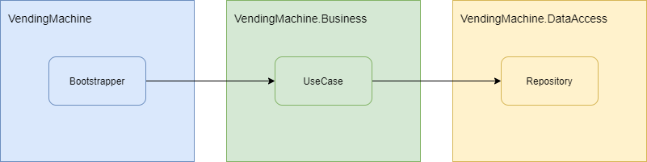
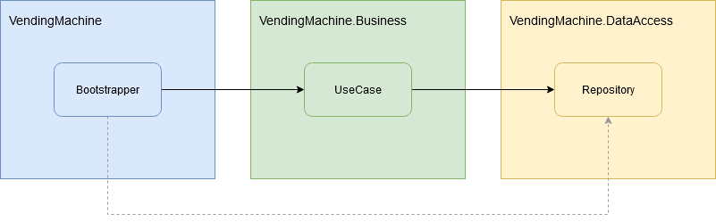
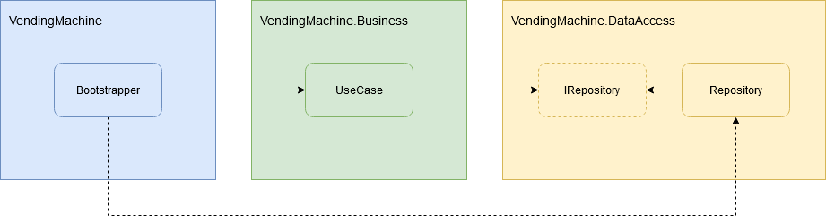
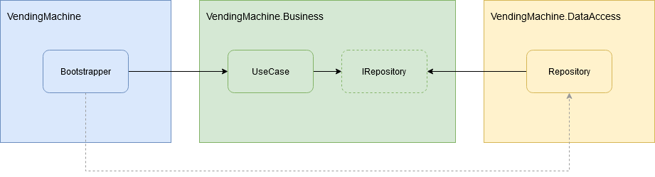

# Dependency Inversion - When DataAccess is aleady extracted

In another article ([How to apply DIP - Module Separation](../how-to-apply-dip/README.md)) we described the steps needed to extract the Presentation and Data  Access modules from the Business. The last step, Inversion of  Dependency, remained a mystery regarding of how we can implement that at class level. I mean, on a high-level block diagram is easy to draw the  arrows in the other direction, but how to do it successfully in the  code?

Let's go into more details. We will describe the inversion  process on one of the module (the Data Access). For the Presentation  module, the process is similar.

## Step 0 - Initial Situation - Business Depends on Data Access

In the Business Module we have a `UseCase` class that instantiates and use a Repository class from Data Access. Clearly, the Business module must  reference the Data Access module, isn't it?



```csharp
public class UseCase : IUseCase
{
    public UseCase()
    {
    }
 
    public void Execute()
    {
        Repository repository = new Repository();
        ...
    }
}
```

## Step 1 - Inject the Repository

First of all we must ensure that the repository is injected into the `UseCase` and not instantiated by hand.

This will force the `Bootstrapper` to reference the Data Access module in  order to instantiate and inject a `Repository` instance into the `UseCase`.



```csharp
public class UseCase : IUseCase
{
    private Repository repository;
  
    public UseCase(Repository repository)
    {
        this.repository = repository ?? throw new ArgumentNullException(nameof(repository));
    }
  
    public void Execute()
    {
        // Use the repository here.
        ...
    }
}
```

## Step 2 - Create the Interface

To invert the dependency, the first step is to create an interface for the `Repository` class and let the `UseCase` use the interface instead of the  real `Repository` type.



```csharp
public class UseCase : IUseCase
{
    private IRepository repository;
  
    public UseCase(IRepository repository)
    {
        this.repository = repository ?? throw new ArgumentNullException(nameof(repository));
    }
  
    public void Execute()
    {
        // Use the repository here.
        ...
    }
}
```

## Step 3 - Move the Interface

Now, the last step is to move the interface into the Business module.

Naturally, the dependency will be inverted: the Data Access module will need to  reference the Business in order to be able to implement the interface.



The `UseCase` class needs no modification for this step.

## Done

Let's recap:

- We injected the `Repository` as dependency into `UseCase` class.
- We created an interface for the dependency.
- We allowed the `Bootstrapper` to decide what concrete implementation of the interface to be injected.
- We moved the interface into the Business module.
