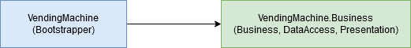
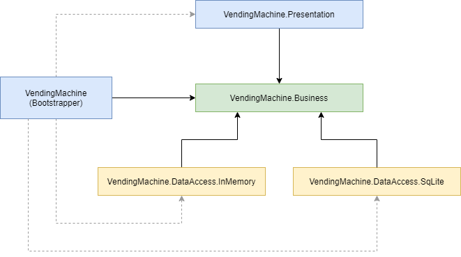

# How to apply DIP - Module Separation

It is a good practice to separate the business logic from  some aspects that are likely to change for different reasons than the  business. For example the database and the user interface.

The purpose is to make the business module independent of any other module.

## Step 0 - The monolith

We start from a monolithic application (one module):

## Step 1 - Separate from Bootstrapper

The firs step is to extract almost all the classes into a new class  library: `VendingMachine.Business`. We will leave behind the Bootstrapper module.

This Bootstrapper module contains:

- The application's **entry point** - the `Program` class containing the `Main` method
- The application's **setup** - the `Bootstrapper` class
- The application's **config file** - app.config file

**Note:** In the end, after the separation is completed, the Bootstrapper module  will be responsible to put everything back together and run the  application.

**Note:** Notice that the Bootstrapper  module references the Business. The Bootstrapper needs to instantiate  classes from Business and run them. The Business knows nothing about the existence of the Bootstrapper.

## Step 2 - Extract Presentation and Data Access Modules - Not so useful way 

The final step is to extract the Presentation and the Data Access modules.

The first impulse is to make the Business references these modules like in the next picture:

But this is a mistake, because it defeats the purpose of making the Business module independent. It now depends on Presentation  and Data Access.

- We do not want that changes in Presentation and Data Access modules to require a change in the Business module.
- In other wards, the rest of the application must adapt when the Business changes, not the other way around.

### Why is Business Module so important?

Because the business module is implementing the business rules required by the  client. They are the reason the whole application exists. So, the implementation of these business rules must depend exclusively on the client's will and should not be restricted by technical details like what database or what delivery mechanism we  choose.

**Note:** Indeed, the problem usually appears not when the application is firstly implemented, because, at this  point, we make it work somehow, but in the next development phases, when the client is requesting changes to the existing behaviour. We must  prepare a modular architecture ready to be easily updated later on.

## Step 2 bis - Apply Dependency Inversion Principle - Better way 

Dependency Inversion Principle states that high level modules like the Business  should not depend upon low level module like Presentation and Data  Access.

Let's draw a new diagram of what we want.

**Note:** The Bootstrapper now needs to  reference the Presentation and Data Access modules in order to  instantiate classes from these modules and inject them into the  Business. (This is that "put everything back together" we were talking  in the beginning.)

At this point it may be a mystery for you how  we can even do this inversion and still have a working application. These articles will further explain at class level what is happening in these  modules:

- [Dependency Inversion 1](../dependency-inversion-1/README.md)
- [Dependency Inversion 2](../dependency-inversion-2/README.md)
